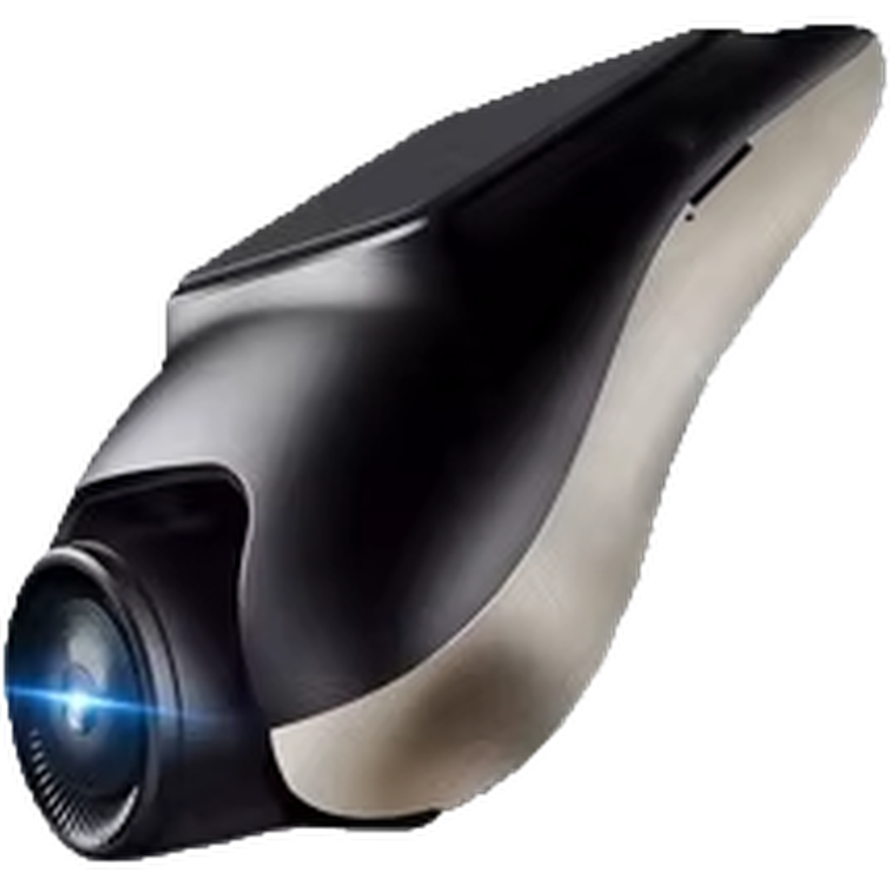

<p align="center">
  
</p>

<h1 align="center">Dashcam Clipper</h1>

<p align="center">Review, combine, trim, and archive front and rear dashcam recordings.</p>

<p align="center"><em>Tested and used with a Junsun F7R701 dashcam and a Junsun V1 Plus MT8768 Android head unit purchased from AliExpress.</em></p>

Dashcam Clipper is a small desktop app for reviewing one-minute front and rear dashcam recordings. It finds driving segments, opens them in VLC, combines both camera views, trims the result, and saves the finished clip to a fixed archive folder.

## Downloads

Ready-to-run builds are available from [GitHub Releases](https://github.com/tomyslo1/dashcamclipper/releases):

- Windows x64 installer: `.exe`
- macOS Apple Silicon installer: `arm64.dmg`
- macOS Intel installer: `x64.dmg`

FFmpeg and VLC are separate requirements and are not bundled with the app. The current installers are unsigned, so Windows SmartScreen or macOS Gatekeeper may ask for confirmation. Code signing and Apple notarization can be added later without changing the application package.

## What it expects

First configure an always-available server library with this structure:

```text
Server library/
├── DCIMA/    front camera recordings
├── DCIMB/    rear camera recordings
└── dashcamclipper/
    └── metadata.json    processing state created by the app
```

A microSD card source only needs `DCIMA` and `DCIMB`; Dashcam Clipper never creates its metadata folder on the card. Subfolders inside both camera folders are scanned too. AVI, MP4, MOV, and MKV files are supported.

Clip modification times are used as recording times. Consecutive clips belong to one driving segment until there is a gap longer than three minutes. If one clip has a modification time at least 12 hours too old but breaks an otherwise continuous numbered sequence, the app places it one minute before its successor without changing the file. These inferred times are identified in the expanded clip list. Front and rear clips are paired by relative filename first, then by a recording time within 30 seconds.

## Requirements

- FFmpeg
- VLC media player
- A supported NVIDIA, AMD, or Intel GPU is optional on Windows

Running or packaging from source also requires Node.js 22.12 or newer and pnpm 11.9.

On Windows, Dashcam Clipper probes NVIDIA NVENC, AMD AMF, Intel Quick Sync, and Windows Media Foundation HEVC encoders, then falls back to CPU `libx265`. On Apple Silicon and other supported Macs, it prefers VideoToolbox HEVC and falls back to `libx265`. A hardware encoder that passes the initial probe but fails on the real video is retried automatically with CPU HEVC.

### Windows setup

Install the external tools from PowerShell:

```powershell
winget install Gyan.FFmpeg
winget install VideoLAN.VLC
```

Close and reopen PowerShell after installation. Then open this repository and run:

```powershell
corepack pnpm install
corepack pnpm start
```

If you already use npm, `npm install` followed by `npm start` works as well.

### macOS setup

With Homebrew installed:

```bash
brew install ffmpeg
brew install --cask vlc
corepack pnpm install
corepack pnpm start
```

## Workflow

1. Choose the permanent server library. This path is saved for later launches.
2. View the server library directly or choose a microSD card as the browsing source.
3. When viewing a card, import files that do not exist in the server library. Existing server files are never overwritten.
4. Show every clip or filter inclusively from a starting date and optional time. An ending date and time are optional.
5. Review the front-camera thumbnail shown for each driving segment when FFmpeg is available.
6. The segment list opens on **Unprocessed**. Switch to **All** or **Processed** when needed.
7. Choose a driving segment:
   - **Play in VLC** opens a playlist of its front-camera clips.
   - **Merge & trim** stacks every front/rear pair vertically and joins the one-minute clips. Rear-camera mirroring is enabled by default, except for its bottom 50-pixel strip, and can be turned off before merging.
   - **Delete** asks twice, then moves both camera files to the Recycle Bin or Trash.
8. Select multiple segments with their checkboxes to merge them into one video, mark them processed or unprocessed together, or delete them with two confirmations. **Select visible** selects the current tab at once.
9. Mark a whole segment as processed, or use **Show clips** to mark individual recordings.
10. Name a merged clip and optionally replace the automatic filename date, time, or both. Leaving either field blank keeps that part from the second clip's modification time. Then set the video's start and end in the built-in trimming screen. The naming dialog offers up to five frequently used names from existing processed MP4 files.
11. Save it to the archive. Only after the save succeeds, every source clip used for the video is marked processed; the original recordings are not deleted.

Finished clips use this filename:

```text
YYYY-MM-DD_HH-mm Clip name (first - last).mp4
```

The timestamp comes from the modification time of the segment's second front-camera clip. The numbers are taken from the numeric suffixes in the first and last source filenames, such as `MOVI0094.avi` through `MOVI0106.avi`. A one-clip segment uses a single number in parentheses.

They are written to:

- Windows: `Y:\Videos\Dashcam\Processed`
- macOS: `/Volumes/cloud/Videos/Dashcam/Processed`

The app reports an error if the archive drive is not connected. It does not silently save to another location.

## Processing metadata

Dashcam Clipper creates `dashcamclipper/metadata.json` only in the configured server library. Even while browsing a microSD card, processed state is read from and written to that server metadata. Processed clips are identified by their relative path inside `DCIMA`, so the state continues to work if the card or library receives a different drive letter or mount point.

Marking a segment processes every visible clip in that segment. A segment counts as processed only when all of its clips are processed; otherwise it remains under **Unprocessed** and shows the partial count. The metadata file is written separately from the recordings and the video files are not modified.

Within each segment and across a selected multi-segment merge, clips are naturally sorted by filename before display, VLC playback, and FFmpeg concatenation. For example, `MOVI0388.avi`, `MOVI0389.avi`, `MOVI0390.avi`, and `MOVI0391.avi` are always processed in that order even when their modification times disagree.

## Importing from a microSD card

When the browsing source differs from the server library, Dashcam Clipper compares every relative filename in `DCIMA` and `DCIMB`. The import banner reports new front and rear files separately. **Import new clips** copies only missing files to the matching server camera folder, including their original subfolder structure, filename casing, and modification time.

Imports use exclusive file creation. If a destination file already exists, including one created after the scan, it is skipped and never replaced. Processing metadata remains on the server and is not copied to or created on the card.

## External tools

Open **External tools** in the top-right corner of the app to see whether FFmpeg and VLC were detected. Use **Choose** to select `ffmpeg.exe` or `vlc.exe` when either program is installed in a custom location. Selected paths are saved in the app settings and reused on the next launch.

Use **Use automatic** to remove a selected path and return to the built-in search of `PATH` and common installation folders. FFmpeg is used for thumbnails, merging, and trimming. VLC is used for segment playback and merged-video previews.

## Custom tool locations

If FFmpeg or VLC is installed somewhere unusual, set one or both variables before starting the app:

```powershell
$env:DASHCAM_CLIPPER_FFMPEG = "C:\Tools\ffmpeg\bin\ffmpeg.exe"
$env:DASHCAM_CLIPPER_VLC = "C:\Program Files\VideoLAN\VLC\vlc.exe"
corepack pnpm start
```

On macOS, set the same environment variable names with `export`.

## Development

```powershell
corepack pnpm test
corepack pnpm run check
corepack pnpm start
```

The app uses Electron with plain HTML, CSS, and JavaScript. No frontend build step is required.

### Building installers locally

On Windows:

```powershell
corepack pnpm install
corepack pnpm run dist:win
```

The installer is written to `dist/Dashcam Clipper-<version>-win-x64.exe`.

On macOS:

```bash
corepack pnpm install
corepack pnpm run dist:mac
```

This creates DMG and ZIP packages for Apple Silicon and Intel Macs in `dist`.

### Publishing a release

The `Build installers` GitHub Actions workflow can be started manually to download test artifacts. Pushing a version tag builds Windows and macOS packages and attaches all of them to a GitHub Release:

```powershell
git tag v0.1.0
git push origin v0.1.0
```

## Acknowledgements

Made with help from OpenAI's GPT-5.6 Sol model at extra-high reasoning effort.
